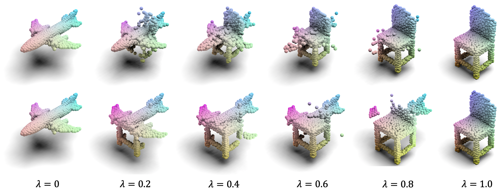
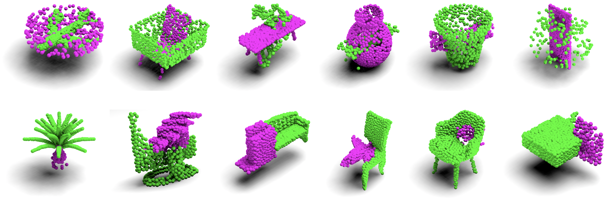

# PointCutMix: Regularization Strategy for Point Cloud Classification
Created by [Zhang, Jinlai](https://github.com/cuge1995) and Chen, Lyujie and Ouyang, Bo and Liu, Binbin and Zhu, Jihong and Chen, Yujing and Meng, Yanmei and Wu, Danfeng.


## Introduction

We propose a simple and effective augmentation method for the point cloud data, named PointCutMix, you can also check out [paper](https://arxiv.org/abs/2101.01461.pdf) for more information.



PointCutMix finds the optimal assignment between two point clouds and generates new training data by replacing the points in one sample with their optimal assigned pairs. Two replacement strategies are proposed to adapt to the accuracy or robustness requirement for different tasks, one of which is to randomly select all replacing points while the other one is to select k nearest neighbors of a single random point. Both strategies consistently and significantly improve the performance of various models on point cloud classification problems. By introducing the saliency maps to guide the selection of replacing points, the performance further improves. Moreover, PointCutMix is validated to enhance the model robustness against the point attack. It is worth noting that when using as a defense method, our method outperforms the state-of-the-art defense algorithms.  

In this repository, we release the code and data for training PointCutMix-K and PointCutMix-R for classification tasks on the ModelNet40 dataset.

### News
* The recent work 'Benchmarking Robustness of 3D Point Cloud Recognition against Common Corruptions' validated that PointCutMix-R is robust to "noise" corruptions and performed best in this benchmark, please [checkout](https://github.com/jiachens/ModelNet40-C).


### Citation

if you find our work useful in your research, please consider citing:

```
@article{zhang2022pointcutmix,
  title={Pointcutmix: Regularization strategy for point cloud classification},
  author={Zhang, Jinlai and Chen, Lyujie and Ouyang, Bo and Liu, Binbin and Zhu, Jihong and Chen, Yujin and Meng, Yanmei and Wu, Danfeng},
  journal={Neurocomputing},
  year={2022},
  publisher={Elsevier}
}
```

## Installation

The code has been tested with Python 3.6, PyTorch 1.3.1 and CUDA 10.0 on Ubuntu 16.04.

```
pip install -r requirements.txt
```
You can also install torch using conda as suggested in [this issue](https://github.com/cuge1995/PointCutMix/issues/3)
```
conda install pytorch-gpu=1.3.1 torchvision cudatoolkit=10.0 -c pytorch
```


## Usage

### Data Preparation

Firstly, you should download the ModelNet40 dataset. 

```
wget https://shapenet.cs.stanford.edu/media/modelnet40_normal_resampled.zip

# change the path of data at line 144 in train_pointcutmix_k.py
DATA_PATH = '/home/your_pc_name/data/modelnet40_normal_resampled/'

```

### Compile
Compile our extension modules:

```
cd emd
python3 setup.py install
```


### Train Model

To train the PointCutMix-K and PointCutMix-R:

```bash
# PointCutMix-K
python train_pointcutmix_k.py --model dgcnn_kcutmix # or pointnet2_kcutmix, pointnet_kcutmix, rscnn_kcutmix
# or
CUDA_VISIBLE_DEVICES=0,1 python train_pointcutmix_k.py --model pointnet2_kcutmix

# PointCutMix-R
python train_pointcutmix_r.py --model dgcnn_rcutmix # or pointnet2_rcutmix, pointnet_rcutmix, rscnn_rcutmix
```

## Licence

Our code is released under MIT License (see LICENSE file for details).
